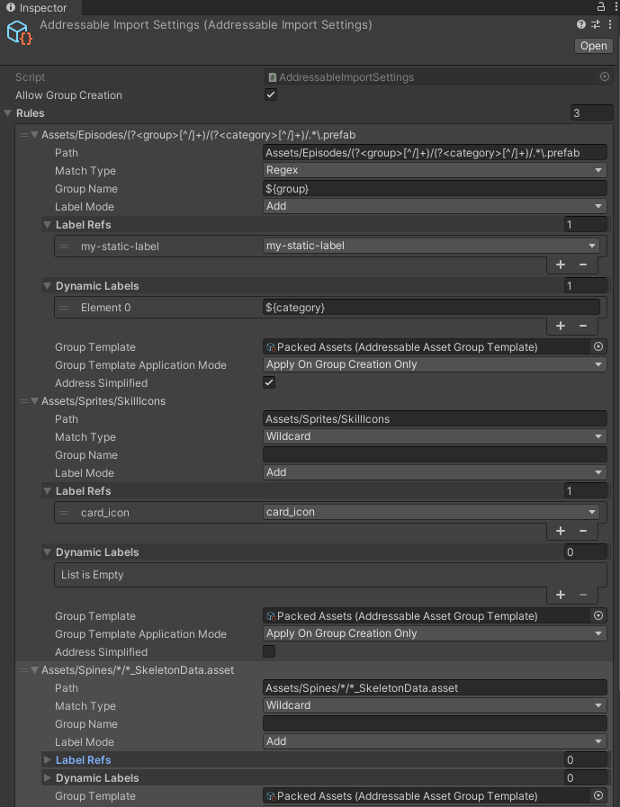
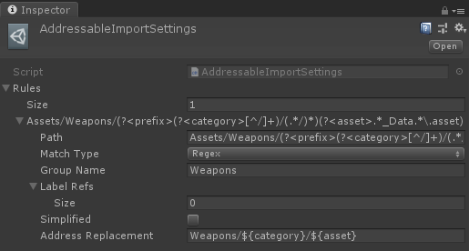

<h1 align="center">Addressable Importer Usage</h1>

Table of Contents
- [Setup the Importer](#setup-the-importer)
- [Define Rules](#define-rules)
- [Rule Examples](#rule-examples)
- [Group Replacement](#group-replacement)
- [Address Replacement](#address-replacement)
- [Label Replacement](#label-replacement)
- [Quick Assets Re-import](#quick-assets-re-import)
- [About Prefab Mode](#about-prefab-mode)
- [ODIN Inspector Support](#odin-inspector-support)

## Setup the Importer

You should create a single AddressableImportSettings file located at `Assets/AddressableAssetsData/AddressableImportSettings.asset`. To create it, go to `Assets/AddressableAssetsData` folder, right click in your project window and choose `Create > Addressables > Import Settings`.


Once the settings file selected, you can edit rules in the inspector window. Then click the `File > Save Project` to apply the changes.



## Define Rules

- `Path`, the path pattern.
- `Match Type`
  - Wildcard, `*` matches any number of characters, `?` matches a single character.
  - Regex.
- `Group Name`, leaves blank for the default group. For dynamic group see [Group Replacement](#group-replacement).
- `Label Mode`, defines if labels will be added or replaced.
- `Label Refs`, The list static labels (already existing in your project) to be added to the Addressable Asset.
- `Dynamic Labels`,The list of dynamic labels to be added to the Addressable Asset. If a label doesn't exist, then it will be create in your unity project.
- `Address Simplified`, simplify address to filename without extension.
- `Address Replacement`, leaves blank to use the asset path as address. For dynamic address see [Address Replacement](#address-replacement).

## Rule Examples

| Type     | Example                                                                         |
|----------|---------------------------------------------------------------------------------|
| Wildcard | `Asset/Sprites/Icons/*`                                                         |
| Wildcard | `Asset/Sprites/Level??/*.asset`                                                 |
| Regex    | `^Assets/Models/.*\.fbx`                                                        |
| Regex    | `Assets/Weapons/(?<prefix>(?<category>[^/]+)/(.*/)*)(?<asset>.*_Data.*\.asset)` |

Because directory itself can be an address entry as well. You need to design your rules with caution to avoid including both folder and files at the same time.

For example,

```
Assets/
  t1/
    1.txt
```

| Rule Path         | Rule Type | Results             | Comments |
|-------------------|-----------|---------------------|----------|
| `Assets/t1`       | Wildcard  | `t1` and `t1/1.txt` | bad      |
| `Assets/t1/*.txt` | Wildcard  | `t1/1.txt`          | good     |
| `^Assets/t1$`     | Regex     | `t1`                | good     |
| `^Assets/t1/.*`   | Regex     | `t1/1.txt`          | good     |

## Group Replacement

The dynamic group is supported by replacing `${name}` with the extracted value from the asset path, via the use of regex capture groups. Named capture groups can be referred to in `Group Name` via `${group}`. If groups are not named, they can be referred to numerically, via `$1`, `$2`, and so on. For more information, refer to [Microsoft Docs - Substitutions in Regular Expressions](https://docs.microsoft.com/en-us/dotnet/standard/base-types/substitutions-in-regular-expressions). This only works for match type Regex.

For convenience, path elements can be referred via `${PATH[index]}`. This works for all match types.

| Asset Path               | Rule Path                                          | Group Name               | Result         |
|--------------------------|-----------------------------------------------|--------------------------|----------------|
| `Assets/Sprites/cat.png` | `Assets/Sprites/*.png`                        | `${PATH[1]}`             | Sprites        |
| `Assets/Sprites/cat.png` | `Assets/Sprites/*.png`                        | `${PATH[-1]}`            | Sprites        |
| `Assets/Sprites/cat.png` | `Assets/Sprites/*.png`                        | `${PATH[1]}-Group`       | Sprites-Group  |
| `Assets/Sprites/cat.png` | `Assets/Sprites/*.png`                        | `${PATH[0]}-${PATH[1]}`  | Assets-Sprites |
| `Assets/cat/cat01.png`   | `Assets/(?<category>[^/]+)/(?<asset>.*)\.png` | `${PATH[0]}:${category}` | Assets:cat     |

## Address Replacement


Similar to [Group Replacement](#group-replacement), address replacement is also supported.

| Asset Path             | Rule Path                                     | Address Replacement               | Result           |
|------------------------|-----------------------------------------------|-----------------------------------|------------------|
| `Assets/cat/cat01.png` | `Assets/(?<category>[^/]+)/(?<asset>.*)\.png` | `${category}-${asset}`            | cat-cat01        |
| `Assets/cat/cat01.png` | `Assets/(?<category>[^/]+)/(?<asset>.*)\.png` | `${PATH[0]}:${category}-${asset}` | Assets:cat-cat01 |

The importer always overrides existing address if
- The address looks like a path (starts with `Assets/`).
- `Address Simplified` is ticked.
- `Address Replacement` is in use.

In another word, if you are intending to manually change the address later, leave `Address Simplified` unticked, `Address Replacement` blank, and do not use `Assets/` prefix for the customized address name.

## Label Replacement
You can add a label to your addressable asset.

You can choose between:
-  `Label Refs`: use a static label already created in Unity project
- `Dynamic Labels`: you can automatically create label in your Unity project and add it to your addressable asset.
  You can use the same rules to create a dynamic name group explained in [Group Replacement](#group-replacement).

| Asset Path             | Rule Path                                     | Label Replacement               | Result           |
|------------------------|-----------------------------------------------|-----------------------------------|------------------|
| `Assets/cat/cat01.png` | `Assets/(?<category>[^/]+)/(.*)\.png` | `${category}`            | cat        |


  For an interactive example you can watch this video: https://youtu.be/r5bCKY6TvP0


The importer always overrides existing labels if `LabelMode = Replace`.

## Quick Assets Re-import

The importer should apply the rules whenever an asset being imported, moved, or deleted. However, if you modified rules or want to apply rules to existing assets, you need to manually apply the rules. To quickly apply the rules, select target folder(s) in the project view, right-click to open the context menu, and then click `AddressableImporter: Check Folder(s)`. The action is more efficient than force reimport assets.


You can also use `ReimportFolders` API to process any folders in code. e.g. re-import all asset folders in a build script. The API requires an array of asset paths. An asset path is a string that starts with "Assets".

```
// Example: process the whole "Assets" folder
AddressableImporter.FolderImporter.ReimportFolders(new string[] { "Assets" });
```

## About Prefab Mode

When both prefab mode (the preview scene for editing a prefab) and the autosave feature are enabled, every modification will cause the asset to be saved and trigger the importer, leads to slow response. For performance reasons, the importer will ignore the current editing asset.

## Odin Inspector Support

Since v0.9.0, the importer supports [Odin inspector](https://assetstore.unity.com/packages/tools/utilities/odin-inspector-and-serializer-89041?aid=1011lJJH) (affiliates) to optimize the user experience. Odin is a paid tool to boost editor plugin development. The integration allows filter or order importer rules easier. The Odin support is optional. To enable it, just install the Odin library.

Since v0.11.0, the importer only support Odin v3. Please make sure the `Scripting Define Symbols` of `Player Settings` contains `ODIN_INSPECTOR` and `ODIN_INSPECTOR_3` flags.


If you no longer use Odin, please remove the flags above, otherwise Unity will report a compile error:

```
error CS0246: The type or namespace name 'ISearchFilterable' could not be found (are you missing a using directive or an assembly reference?)
```

Notice that the Odin support may be moved to an additional plugin or discontinued if the importer's UX gets improved in the future.
